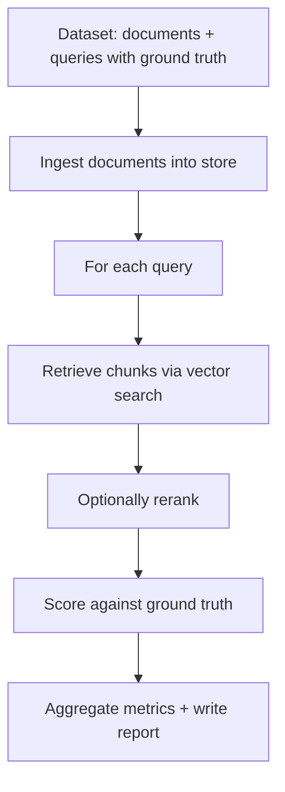

<Callout type="warn">
Evaluation is currently **experimental**. The core workflow is stable, but expect the dataset schema and report format to evolve as we learn from real-world usage.
</Callout>

Building a RAG system is straightforward. Building one that retrieves the right content for a given query is harder than it looks. The initial implementation usually works well enough that you ship it, but over time you want to make changes—different chunking parameters, a new embedding model, maybe adding a reranker. Each change feels like it should improve things, but without measurement, you're guessing.

This is where retrieval evaluation comes in. Instead of manual spot-checking or hoping the LLM produces better answers, you build a dataset of queries with known relevant documents and measure how well your retrieval pipeline surfaces them. When you change your chunking strategy from 200 to 400 words, you can see exactly how that affects recall. When you switch embedding providers, you know whether precision improved or degraded.

## What the eval harness does

Unrag's evaluation harness is an optional module you install like any other battery. It gives you a structured way to define test datasets, run retrieval (and optionally reranking) against them, and produce metrics that tell you how well your system is performing. The output is deterministic—run the same dataset against the same configuration and you get the same numbers—which means you can track changes over time and catch regressions before they reach production.

The harness focuses specifically on retrieval quality, not end-to-end answer quality. It doesn't call an LLM, doesn't grade generated answers, doesn't try to measure hallucination or citation accuracy. Those things matter, but they're harder to measure reliably and depend heavily on your prompt engineering and model choice. Retrieval is the foundation: if your system can't find the right content, no amount of prompt tuning will save you.

By staying focused on retrieval, the harness can give you precise, reproducible metrics. You know exactly what "recall@10 of 0.85" means, and you can compare that number across runs, across configurations, across time.

## When to use evaluation

The obvious time to evaluate is before deploying a change. You've retuned your chunk overlap, and you want to know if it helped. You're considering a more expensive embedding model, and you want to see if the quality improvement justifies the cost. These are the cases where evaluation pays off immediately.

But evaluation is also valuable for understanding your system's baseline behavior. What queries does your current configuration handle well? What queries does it struggle with? If you only evaluate when making changes, you're missing the chance to understand your system's strengths and weaknesses. A periodic eval run—even without changes—can surface queries that started failing after you ingested new content, or areas where your test dataset doesn't cover real user behavior.

Finally, evaluation is essential for CI pipelines. When someone opens a pull request that touches your RAG configuration, you want automated checks that verify retrieval quality hasn't regressed. The eval harness produces JSON reports and exit codes that integrate naturally with CI systems.

## The mental model

The harness operates on a simple model: you have documents, you have queries, and for each query you know which documents are relevant. When you run an evaluation, the harness ingests your documents (if needed), runs each query through your retrieval pipeline, and compares the retrieved results against the known-relevant documents. The comparison produces metrics like precision, recall, and MRR that quantify retrieval quality.

The documents in your eval dataset don't have to be your real production content. In fact, it's often better to use a curated subset that you understand well enough to label. The goal is to have ground truth you're confident in, even if it's small. A dataset of 50 queries with accurate relevance labels is more valuable than 500 queries where you're guessing.

## A note on ground truth

The hardest part of evaluation isn't running the harness; it's building a dataset with accurate relevance labels. For each query, you need to know which documents should be retrieved. This requires human judgment, and human judgment is expensive and sometimes inconsistent.

There's no magic solution here. The eval harness gives you the infrastructure to run evaluations and track metrics over time, but the quality of those metrics depends on the quality of your ground truth. Investing time in building a good dataset—even a small one—pays off more than running sophisticated metrics on noisy labels.

The dataset documentation includes strategies for building ground truth incrementally, using retrieval failures to find gaps, and maintaining datasets as your content evolves.

## Getting started

Ready to set up evaluation? Start with the installation and first eval run:

<Cards>
  <Card title="Getting Started" href="/docs/eval/getting-started">
    Install the eval battery and run your first evaluation
  </Card>
  <Card title="Dataset Format" href="/docs/eval/datasets">
    Structure your documents and queries for evaluation
  </Card>
  <Card title="RAG Handbook: Evaluation" href="/docs/rag/07-evaluation">
    Comprehensive guide to measuring RAG quality, building eval datasets, and offline/online evaluation strategies
  </Card>
</Cards>
