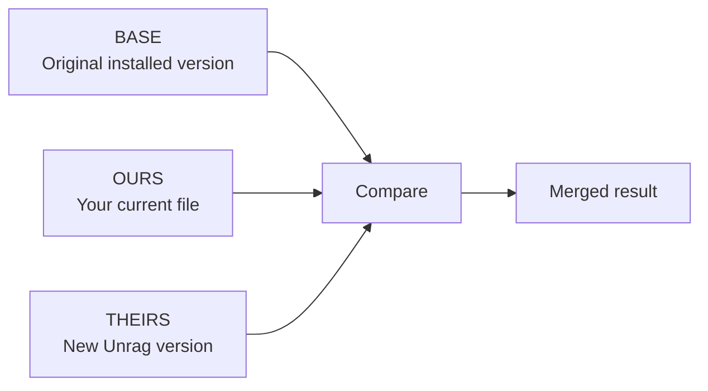
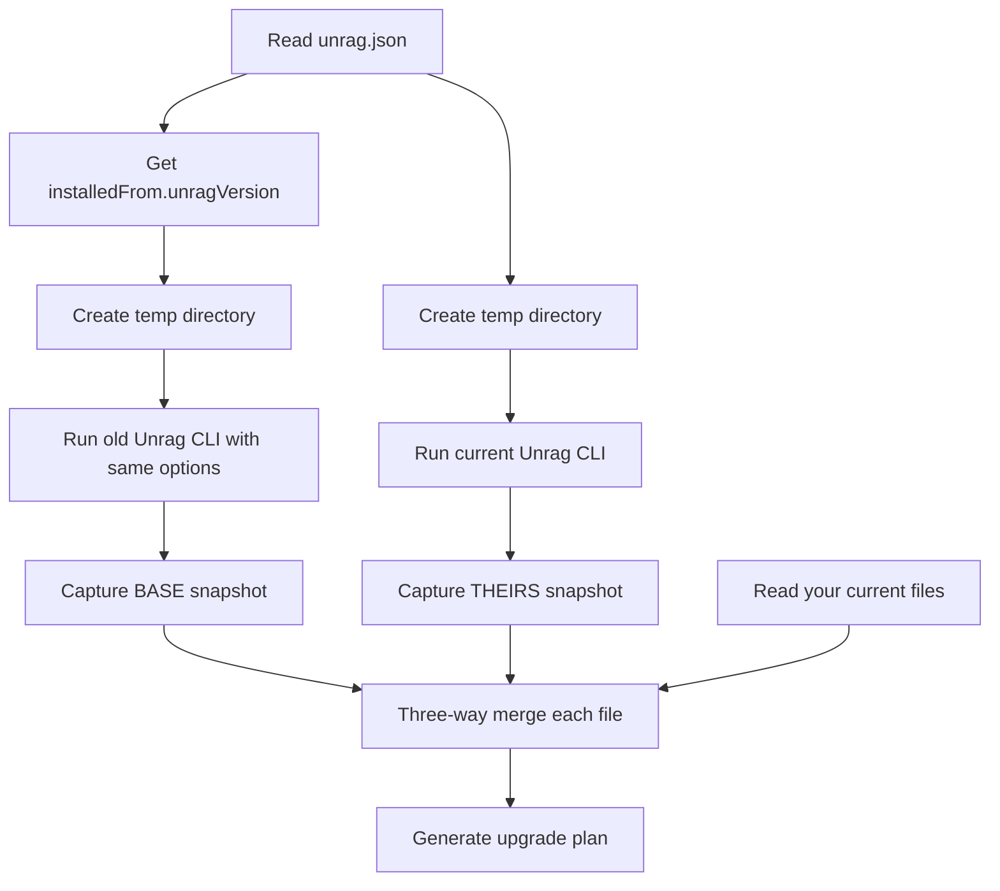

The upgrade system uses the same merging strategy that powers Git. Understanding how it works helps you predict what will happen during an upgrade and makes conflict resolution less mysterious when it's needed.

## The three versions

Every upgrade involves comparing three versions of each file:



**BASE** is the common ancestor—what the file looked like when you first installed it (or after your last upgrade). This version is reconstructed by running the old Unrag CLI in a temporary environment.

**OURS** is what you have now. This includes the original installation plus any modifications you've made.

**THEIRS** is what the new Unrag version provides. This is what you'd get if you ran `unrag init` fresh today.

By comparing all three, the merge algorithm can identify exactly what changed on each side and combine those changes intelligently.

## How changes are detected

The comparison happens at the text level, line by line. For each file, the algorithm determines:

1. **Did OURS change from BASE?** If your file differs from the original, you've customized it.
2. **Did THEIRS change from BASE?** If the new version differs from the original, there are upstream updates.

This creates four possibilities:

| OURS changed? | THEIRS changed? | Result |
|---------------|-----------------|--------|
| No | No | File is unchanged—nothing to do |
| No | Yes | Safe to update—take the new version |
| Yes | No | Keep your version—upstream didn't change |
| Yes | Yes | Merge needed—both sides have changes |

The first three cases are straightforward. The fourth case—where both sides changed—is where the three-way merge algorithm earns its keep.

## The merge algorithm

When both you and Unrag modified the same file, the algorithm attempts to combine the changes. It works by identifying which lines changed on each side:

```
BASE (original):
  line 1: const chunkSize = 200;
  line 2: const overlap = 50;
  line 3: export function chunk(text) { ... }

OURS (your version):
  line 1: const chunkSize = 400;        // You changed this
  line 2: const overlap = 50;
  line 3: export function chunk(text) { ... }

THEIRS (new version):
  line 1: const chunkSize = 200;
  line 2: const overlap = 100;          // Unrag changed this
  line 3: export function chunk(text) { ... }

MERGED RESULT:
  line 1: const chunkSize = 400;        // Your change preserved
  line 2: const overlap = 100;          // Unrag's change applied
  line 3: export function chunk(text) { ... }
```

The algorithm detects that you changed line 1 (chunkSize) while Unrag changed line 2 (overlap). Since these changes don't overlap, they can both be applied cleanly.

## When conflicts occur

Conflicts happen when both sides modify the same lines. The algorithm can't automatically decide whose changes should win:

```
BASE:
  const maxTokens = 1000;

OURS:
  const maxTokens = 2000;   // You doubled it

THEIRS:
  const maxTokens = 1500;   // Unrag increased it

CONFLICT:
  <<<<<<< OURS
  const maxTokens = 2000;
  =======
  const maxTokens = 1500;
  >>>>>>> THEIRS
```

In this case, both versions changed the same line to different values. The merged file contains conflict markers showing both options. You need to manually edit the file, choose the right value, and remove the markers.

See [Handling Conflicts](/docs/upgrade/handling-conflicts) for strategies to resolve these situations.

## Snapshot generation

The upgrade command needs the BASE version to perform three-way merging, but that original version isn't stored anywhere in your project—you only have OURS (your current files). So where does BASE come from?

The CLI generates BASE dynamically by running the old version of Unrag in a temporary environment. Here's what happens:

1. The upgrade command reads your `unrag.json` to find `installedFrom.unragVersion`
2. It creates a temporary directory with a minimal `package.json`
3. It runs `bunx unrag@<old-version> init` (and any `add` commands for extractors/connectors/batteries) with your original settings
4. The resulting files become the BASE snapshot
5. Similarly, it runs the current CLI to generate the THEIRS snapshot
6. Now it has BASE, OURS (your files), and THEIRS (current version) for comparison

This approach means the CLI doesn't need to store historical versions of every file. It can reconstruct any BASE on demand by re-running the appropriate Unrag version.



## The upgrade plan

Before writing any files, the upgrade command generates a complete plan of what will happen. Each file gets classified into one of these actions:

**add** — New files that exist in THEIRS but not in your project. These are features or components added in the new version.

**update** — Files where you haven't made changes (OURS equals BASE) but THEIRS has updates. Safe to replace entirely.

**merge** — Files where both sides changed and the three-way merge succeeded. The merged content combines your changes with upstream changes.

**conflict** — Files where both sides changed the same lines and automatic merging failed. The file will contain conflict markers for manual resolution.

**keep** — Files you modified but THEIRS didn't change from BASE. Your customizations are preserved exactly.

**unchanged** — Files that haven't changed in any version. Nothing needs to happen.

**removed-upstream** — Files that existed in BASE but no longer exist in THEIRS. Unrag removed this file in the new version. Your copy remains, but you might want to delete it.

**skipped** — Files that couldn't be merged because there's no BASE to compare against. This happens for files that weren't tracked in your original installation.

The plan is shown before any files are written, so you can review and decide whether to proceed.

## Git integration

The upgrade command leverages Git in two ways:

**Dirty working tree detection** — Before upgrading, the command checks if you have uncommitted changes. Upgrading with uncommitted changes makes it hard to see what the upgrade changed versus what you had pending. The command warns you and, in non-interactive mode, refuses to proceed unless you pass `--allow-dirty`.

**Using git merge-file** — When performing three-way merges, the CLI prefers to use Git's `git merge-file` command if available. Git's implementation is mature and handles edge cases well. If Git isn't available, the CLI falls back to a built-in implementation that produces similar results.

## Dependency updates

Besides file changes, upgrades can affect your dependencies. The new Unrag version might require:

- New dependencies that didn't exist before
- Updated versions of existing dependencies
- Different dependencies based on your configuration

The upgrade command handles this by comparing the required dependencies for your configuration (adapter, embedding provider, extractors, connectors, batteries) against what's in your `package.json`. It updates versions when the existing version doesn't satisfy the new requirement.

```
Deps: ai, drizzle-orm (updated), pdfjs-dist
Next: run `bun install`
```

The "(updated)" marker indicates a dependency whose version was bumped. After the upgrade, run your package manager to install the updated dependencies.

## Tracking state

After a successful upgrade, the CLI updates `unrag.json` with:

- The new `installedFrom.unragVersion` (the version you just upgraded to)
- An updated `managedFiles` list (in case new files were added)

This information becomes the BASE for your next upgrade. The cycle continues: each upgrade builds on the previous one, allowing you to upgrade incrementally over time while preserving customizations at each step.

## Edge cases

### Files without a BASE

If you manually added files to your Unrag directory, or if tracking wasn't enabled when you first installed, some files might not have a BASE version. These are marked as "skipped" in the upgrade plan.

With `--overwrite force`, these files would be replaced by THEIRS. With the default `--overwrite skip`, they're left alone. Neither option is perfect—the former might overwrite your additions, the latter might leave stale content.

For these files, manually compare your version with the new version and decide what to keep.

### Deleted files

If you deleted a file that Unrag originally installed, the upgrade detects this (OURS is missing, BASE existed). The default behavior is to not recreate the file—the assumption is that you deleted it intentionally.

If THEIRS has significant changes to a file you deleted, you might want to review what's new and decide whether to bring it back.

### Renamed files

The upgrade system operates on file paths. If Unrag renamed a file between versions (say, from `utils.ts` to `helpers.ts`), the old file appears as "removed-upstream" and the new file appears as "add". Any customizations you made to the old file won't be automatically transferred.

Check the changelog when upgrading to see if any renames occurred, and manually migrate your customizations if needed.

## Next steps

<Cards>
  <Card title="Handling Conflicts" href="/docs/upgrade/handling-conflicts">
    What to do when automatic merging isn't enough
  </Card>
  <Card title="Getting Started" href="/docs/upgrade/getting-started">
    Walk through your first upgrade
  </Card>
</Cards>
