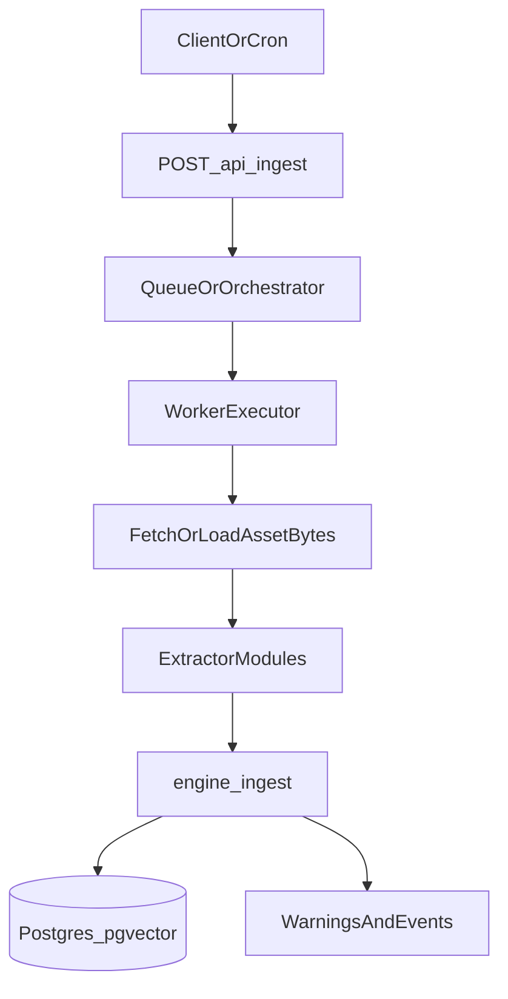

Running rich-media extraction (PDF analysis, OCR, transcription) inside a single HTTP request is fragile on serverless platforms. You’ll hit timeouts, memory limits, and flaky network behavior—especially when ingesting content from sources like Notion (signed URLs that expire).

This guide shows a **production-safe pattern** for Next.js on **Vercel serverless**:

- **Route Handler** receives an ingest request and enqueues a job (fast, reliable)
- **Worker** executes extraction + `engine.ingest()` with retries and bounded concurrency
- **Observability**: you monitor `result.warnings` + structured events so nothing is silently dropped

## The production pattern



## Key constraints on Vercel

- **Do not run this on Edge runtime** for extraction. Use **Node.js runtime** Route Handlers.
- **Long-running work** (big PDFs/audio) should be offloaded to a queue/orchestrator.
- **Notion signed URLs expire**. For delayed processing you must either:
  - fetch bytes immediately and store in durable storage (S3/R2/GCS), or
  - process immediately while the URL is still valid.

## Make extraction modular (Extractor Modules)

Unrag’s core ingestion can route assets to extractor modules. For PDFs, install and register the Gemini extractor:

```bash
bunx unrag@latest add extractor pdf-llm --yes
```

Then register it in your `unrag.config.ts`:

```ts
import { createPdfLlmExtractor } from "./lib/unrag/extractors/pdf-llm";

export const unrag = defineUnragConfig({
  // ...
  engine: {
    // ...
    extractors: [createPdfLlmExtractor()],
  },
} as const);
```

<Callout type="warn">
Some extractors are **worker-only** by design (they require native binaries or long runtimes), for example:
`pdf:ocr` (Poppler + Tesseract) and `video:frames` (ffmpeg).
</Callout>

## Observability: warnings + events

In production, treat ingestion warnings as signals:

```ts
const result = await engine.ingest(input);

if (result.warnings.length > 0) {
  // send to your logger / metrics / alerting
  console.warn("unrag ingest warnings", result.warnings);
}
```

You can also attach structured events via `assetProcessing.hooks.onEvent` (useful for per-asset timings and extractor success/error):
See [AssetProcessingEvent](/docs/reference/asset-processing#assetprocessingevent) for the event shape.

```ts
assetProcessing: {
  // ...
  hooks: {
    onEvent: (e) => {
      // forward to logs/metrics
      console.log("unrag assetProcessing event", e);
    },
  },
}
```

## Option A (recommended): QStash on Vercel

QStash is a great fit for Vercel because it provides **durable retries** and doesn’t require a long-running worker process.

### 1) Ingest route enqueues a job

```ts
// app/api/ingest/route.ts
import { NextResponse } from "next/server";
import { Client } from "@upstash/qstash";

export async function POST(req: Request) {
  const body = await req.json();

  const client = new Client({ token: process.env.QSTASH_TOKEN! });

  await client.publishJSON({
    url: process.env.QSTASH_WORKER_URL!, // e.g. https://yourapp.vercel.app/api/worker
    body,
  });

  return NextResponse.json({ ok: true }, { status: 202 });
}
```

### 2) Worker route performs extraction + ingest

```ts
// app/api/worker/route.ts
import { NextResponse } from "next/server";
import { verifySignatureAppRouter } from "@upstash/qstash/nextjs";
import { createUnragEngine } from "@/unrag.config";

export const POST = verifySignatureAppRouter(async (req: Request) => {
  const job = await req.json();
  const engine = createUnragEngine();

  const result = await engine.ingest(job.ingestInput);

  if (result.warnings.length) {
    console.warn("unrag ingest warnings", result.warnings);
  }

  return NextResponse.json({ ok: true });
});
```

### Notes

- Use `assetProcessing.fetch.allowedHosts` to prevent SSRF when fetching URL-based assets.
- If you need delayed processing, store bytes in durable storage first (Notion URLs expire).

## Option B: BullMQ (Redis) + separate worker

BullMQ requires a **long-running worker process**. That’s not a good fit for “pure Vercel serverless”, but it works well if you run a worker on Fly/ECS/K8s while your Next.js app stays on Vercel.

### Producer (Next.js route)

```ts
// app/api/ingest/route.ts
import { NextResponse } from "next/server";
import { Queue } from "bullmq";

const queue = new Queue("unrag-ingest", {
  connection: { url: process.env.REDIS_URL! },
});

export async function POST(req: Request) {
  const body = await req.json();
  await queue.add("ingest", body, { attempts: 5, backoff: { type: "exponential", delay: 1000 } });
  return NextResponse.json({ ok: true }, { status: 202 });
}
```

### Worker (separate Node process)

```ts
// worker.ts (run on Fly/ECS/etc.)
import { Worker } from "bullmq";
import { createUnragEngine } from "./unrag.config";

new Worker(
  "unrag-ingest",
  async (job) => {
    const engine = createUnragEngine();
    const result = await engine.ingest(job.data.ingestInput);
    if (result.warnings.length) console.warn("unrag ingest warnings", result.warnings);
  },
  { connection: { url: process.env.REDIS_URL! }, concurrency: 4 }
);
```

### Notes

- This option gives you strong control over concurrency and throughput.
- Your worker can also support native dependencies (OCR, ffmpeg) more easily than serverless.

## Option C: Inngest

Inngest is a great middle ground: you keep your Next.js app on Vercel, and Inngest runs the workflow with retries and step-level observability.

### Trigger an Inngest function

```ts
// app/api/ingest/route.ts
import { NextResponse } from "next/server";
import { inngest } from "@/lib/inngest/client";

export async function POST(req: Request) {
  const body = await req.json();
  await inngest.send({ name: "unrag/ingest.requested", data: body });
  return NextResponse.json({ ok: true }, { status: 202 });
}
```

### Workflow function

```ts
// lib/inngest/functions/unragIngest.ts
import { inngest } from "../client";
import { createUnragEngine } from "@/unrag.config";

export const unragIngest = inngest.createFunction(
  { id: "unrag-ingest" },
  { event: "unrag/ingest.requested" },
  async ({ event }) => {
    const engine = createUnragEngine();
    const result = await engine.ingest(event.data.ingestInput);
    if (result.warnings.length) console.warn("unrag ingest warnings", result.warnings);
    return { ok: true, warnings: result.warnings.length };
  }
);
```

## Practical hardening checklist

- **Always use Node runtime** for ingestion/extraction.
- **Restrict fetch hosts**: set `assetProcessing.fetch.allowedHosts`.
- **Set concurrency**: `assetProcessing.concurrency` for extractor I/O.
- **Alert on warnings**: treat `result.warnings.length > 0` as something to investigate.
- **Handle Notion URLs**: process immediately or copy bytes to your storage.
- **Avoid client-side secrets**: keep tokens and API keys server-only.

## Related

<Cards>
  <Card title="Asset Processing" href="/docs/reference/asset-processing">
    Policies, fetch safety, and PDF extraction configuration
  </Card>
  <Card title="Ingest Rich Media" href="/docs/guides/ingest-rich-media">
    Practical guide to ingesting PDFs and images
  </Card>
  <Card title="Notion Connector" href="/docs/connectors/notion/api">
    Sync Notion pages and ingest assets
  </Card>
</Cards>

