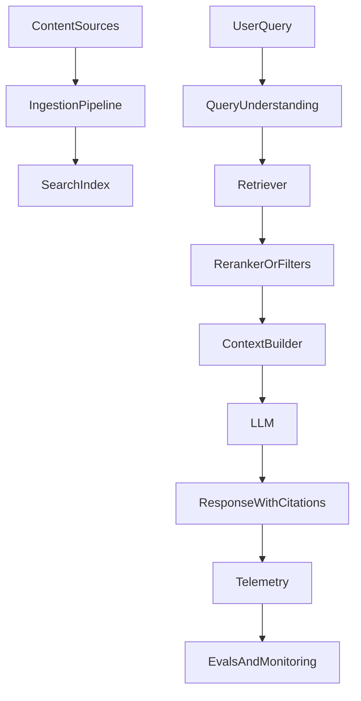

<Callout type="warn" title="Status: Stub">
This chapter is a stub. It outlines the system diagram and the “contracts” between components.
</Callout>

## The big picture

At a minimum, a production RAG system has:

- **Ingestion** (turn your content into a searchable representation)
- **Retrieval** (find candidate context for a user query)
- **Ranking / filtering** (decide what’s actually relevant and permitted)
- **Context building** (pack evidence into the model input)
- **Generation** (produce an answer with citations and refusal behavior)
- **Evaluation and monitoring** (detect regressions and drift)

## The end-to-end flow (draft)

## What “production-grade” really means (preview)

- You can explain every answer with **sources**
- You can reproduce and measure changes (evals)
- You enforce permissions before retrieval/generation
- You have latency/cost budgets and fallbacks

## Optional: how this maps to Unrag

Unrag covers the storage + retrieval primitives (ingest/retrieve/rerank/delete). Your app owns context building and generation. See `/docs/concepts/architecture` and `/docs/concepts/performance`.

